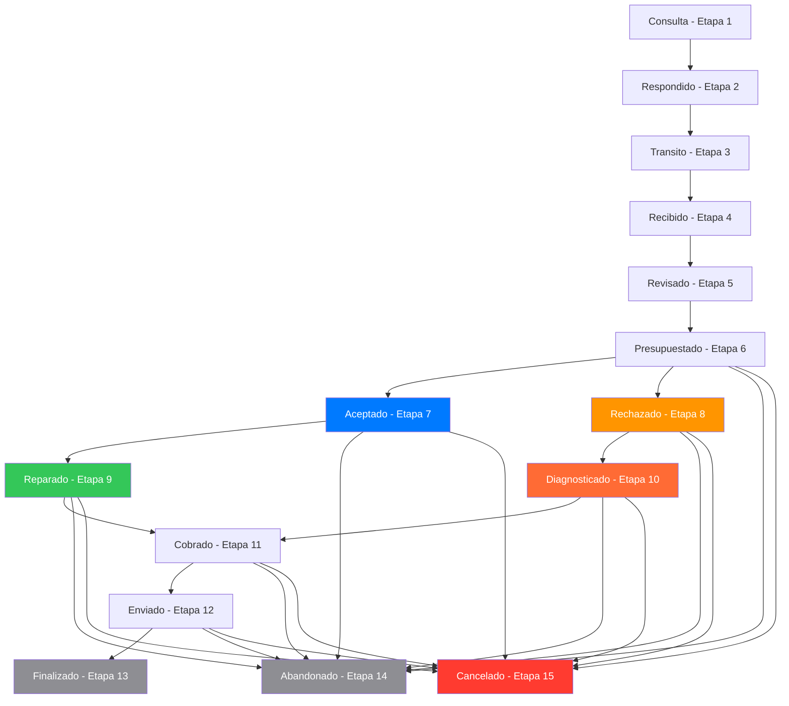

# Diagrama de Flujo de Estados - Sistema de Reparaciones McDron

## Estados Principales (Etapas 1-15)



## Reglas y Condiciones Específicas

### 1. **Flujo Lineal Inicial (Etapas 1-6)**
- **Consulta → Respondido → Transito → Recibido → Revisado → Presupuestado**
- Cada estado solo puede avanzar al siguiente
- Solo administradores pueden cambiar estados

### 2. **Bifurcación Crítica (Etapa 6 → 7/8)**
```
Presupuestado (Etapa 6)
    ├── Cliente acepta → Aceptado (Etapa 7)
    └── Cliente rechaza → Rechazado (Etapa 8)
```

### 3. **Flujos Paralelos Exclusivos**

#### **Flujo A: Presupuesto ACEPTADO**
```
Aceptado (Etapa 7) → Reparado (Etapa 9)
```
- **Condición**: Solo si estado actual es "Aceptado"
- **Restricción**: NO se puede ir a "Diagnosticado"
- **Acción**: Reparar el equipo

#### **Flujo B: Presupuesto RECHAZADO**
```
Rechazado (Etapa 8) → Diagnosticado (Etapa 10)
```
- **Condición**: Solo si estado actual es "Rechazado"
- **Restricción**: NO se puede ir a "Reparado"
- **Acción**: Solo diagnóstico (cobro menor)

### 4. **Convergencia (Etapas 9/10 → 11)**
```
Reparado (Etapa 9) ──┐
                     ├── Cobrado (Etapa 11)
Diagnosticado (Etapa 10) ──┘
```

### 5. **Flujo Final (Etapas 11-13)**
```
Cobrado → Enviado → Finalizado
```

## Lógica de Botones en la UI

### En Sección PRESUPUESTO:
```javascript
// Si puede avanzar a Aceptado Y no está en Rechazado
if (puedeAvanzarA('Aceptado') && reparacion.data.EstadoRep !== 'Rechazado') {
    // Mostrar botón "Presupuesto Aceptado"
}

// Si puede avanzar a Rechazado Y no está en Aceptado  
if (puedeAvanzarA('Rechazado') && reparacion.data.EstadoRep !== 'Aceptado') {
    // Mostrar botón "Presupuesto Rechazado"
}
```

### En Sección REPARAR:
```javascript
// Solo si está en Aceptado
if (reparacion.data.EstadoRep === 'Aceptado' && puedeAvanzarA('Reparado')) {
    // Mostrar botón "Marcar como Reparado"
}

// Solo si está en Rechazado
if (reparacion.data.EstadoRep === 'Rechazado' && puedeAvanzarA('Diagnosticado')) {
    // Mostrar botón "Marcar como Diagnosticado"  
}
```

## Función `puedeAvanzarA()` - Lógica Central

```javascript
const puedeAvanzarA = (nombreEstado: string): boolean => {
    if (!isAdmin) return false;
    
    const estadoActual = obtenerEstadoSeguro(reparacion.data.EstadoRep);
    const estadoDestino = estados[nombreEstado];
    
    // Lógica especial para flujos exclusivos
    if (nombreEstado === 'Reparado') {
        return estadoActual.nombre === 'Aceptado';
    }
    if (nombreEstado === 'Diagnosticado') {
        return estadoActual.nombre === 'Rechazado';  
    }
    
    // Regla general: solo avanzar a etapas superiores
    return estadoDestino.etapa > estadoActual.etapa;
};
```

## Estados Legacy (Retrocompatibilidad)

- **Etapas 100+**: Estados del sistema anterior
- **Indefinido (Etapa 0)**: Estado por defecto para migrar
- **Reparar/Repuestos → Aceptado**
- **Entregado → Finalizado**  
- **Liquidación → Cancelado**

## Colores por Estado

| Estado | Color | Etapa | Prioridad |
|--------|-------|-------|-----------|
| Consulta | #ff9500 | 1 | 1 |
| Respondido | #5ac8fa | 2 | 3 |
| Transito | #cddc39 | 3 | 2 |
| Recibido | #ffcc00 | 4 | 1 |
| Revisado | #ff6b22 | 5 | 1 |
| Presupuestado | #ff2d55 | 6 | 2 |
| **Aceptado** | **#007aff** | **7** | **1** |
| **Rechazado** | **#ff9500** | **8** | **1** |
| **Reparado** | **#34c759** | **9** | **3** |
| **Diagnosticado** | **#ff6b35** | **10** | **3** |
| Cobrado | #673ab7 | 11 | 4 |
| Enviado | #af52de | 12 | 3 |
| Finalizado | #8e8e93 | 13 | 5 |
| Abandonado | #8e8e93 | 14 | 5 |
| Cancelado | #ff3b30 | 15 | 5 |

## Resumen de Restricciones Clave

1. **Exclusividad Aceptado/Rechazado**: Una vez en etapa 7 u 8, no se puede ir al estado contrario
2. **Flujos Paralelos**: Aceptado solo puede ir a Reparado, Rechazado solo a Diagnosticado  
3. **Convergencia**: Ambos flujos convergen en Cobrado (etapa 11)
4. **Solo Admin**: Solo administradores pueden cambiar estados
5. **Progresión**: Solo se puede avanzar a etapas superiores (salvo excepciones legacy)
