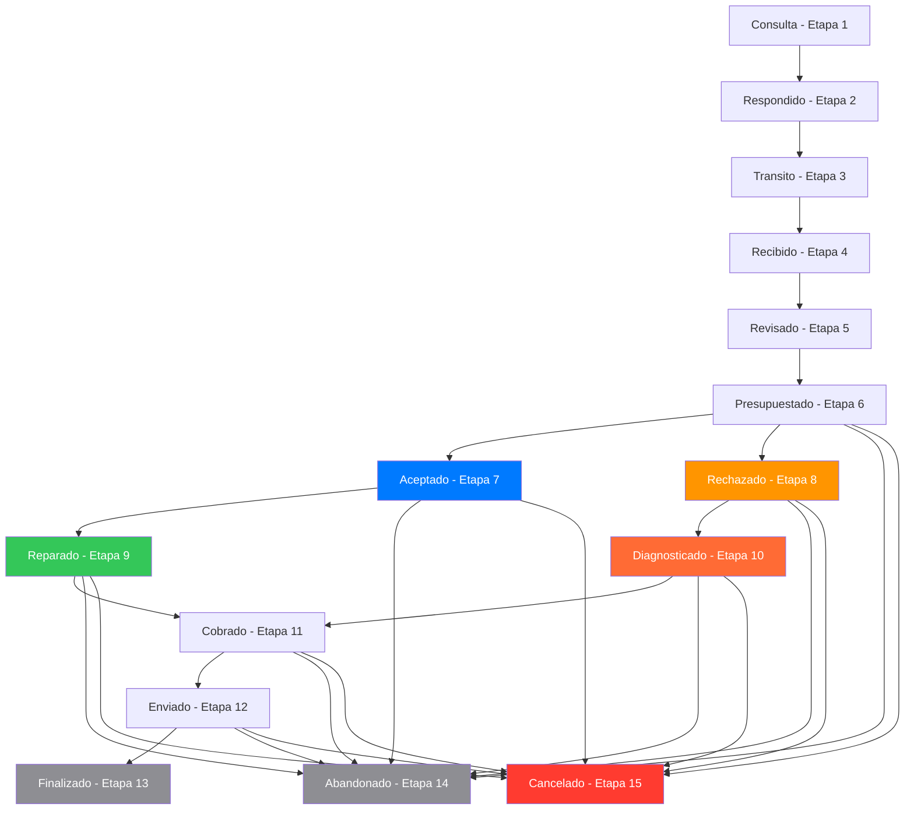

# Diagrama de Flujo de Estados - Sistema de Reparaciones McDron
## 📍 Documentación alineada con `Reparacion.component.tsx`

## Estados Principales (Etapas 1-15)



## Reglas y Condiciones Específicas

### 1. **Flujo Lineal Inicial (Etapas 1-6)**
- **Consulta → Respondido → Transito → Recibido → Revisado → Presupuestado**
- Cada estado solo puede avanzar al siguiente
- Solo administradores pueden cambiar estados

### 2. **Bifurcación Crítica (Etapa 6 → 7/8)**
```
Presupuestado (Etapa 6)
    ├── Cliente acepta → Aceptado (Etapa 7)
    └── Cliente rechaza → Rechazado (Etapa 8)
```

### 3. **Flujos Paralelos Exclusivos**

#### **Flujo A: Presupuesto ACEPTADO**
```
Aceptado (Etapa 7) → Reparado (Etapa 9)
```
- **Condición**: Solo si estado actual es "Aceptado"
- **Restricción**: NO se puede ir a "Diagnosticado"
- **Acción**: Reparar el equipo

#### **Flujo B: Presupuesto RECHAZADO**
```
Rechazado (Etapa 8) → Diagnosticado (Etapa 10)
```
- **Condición**: Solo si estado actual es "Rechazado"
- **Restricción**: NO se puede ir a "Reparado"
- **Acción**: Solo diagnóstico (cobro menor)

### 4. **Convergencia (Etapas 9/10 → 11)**
```
Reparado (Etapa 9) ──┐
                     ├── Cobrado (Etapa 11)
Diagnosticado (Etapa 10) ──┘
```

### 5. **Flujo Final (Etapas 11-13)**
```
Cobrado → Enviado → Finalizado
```

## Lógica de Botones en la UI (IMPLEMENTACIÓN REAL)

### En Sección PRESUPUESTO:
```typescript
// Botones se muestran según la función puedeAvanzarA() únicamente
{(puedeAvanzarA('Aceptado') || puedeAvanzarA('Rechazado')) && (
    <div className="d-flex flex-wrap gap-2">
        {puedeAvanzarA('Aceptado') && (
            <button onClick={avanzarAAceptado}>
                Presupuesto Aceptado
            </button>
        )}
        {puedeAvanzarA('Rechazado') && (
            <button onClick={avanzarARechazado}>
                Presupuesto Rechazado
            </button>
        )}
    </div>
)}
```

### En Sección REPARAR:
```typescript
// La lógica está centralizada en puedeAvanzarA()
{puedeAvanzarA('Reparado') && (
    <button onClick={avanzarAReparado}>
        Marcar como Reparado
    </button>
)}
{puedeAvanzarA('Diagnosticado') && (
    <button onClick={avanzarADiagnosticado}>
        Marcar como Diagnosticado
    </button>
)}
```

## Función `puedeAvanzarA()` - Lógica Central (IMPLEMENTACIÓN REAL)

```typescript
const puedeAvanzarA = (nombreEstado: string): boolean => {
    if (!isAdmin) return false;
    const estadoActual = obtenerEstadoSeguro(reparacion.data.EstadoRep);
    const estadoDestino = estados[nombreEstado];
    
    // Lógica especial para los flujos de Aceptado/Rechazado
    if (nombreEstado === 'Reparado') {
        return estadoActual.nombre === 'Aceptado';
    }
    if (nombreEstado === 'Diagnosticado') {
        return estadoActual.nombre === 'Rechazado';
    }

    // Prevenir cambio entre Aceptado y Rechazado
    if (estadoActual.nombre === 'Aceptado' && nombreEstado === 'Rechazado') return false;
    if (estadoActual.nombre === 'Rechazado' && nombreEstado === 'Aceptado') return false;
    
    // Regla general: solo avanzar a etapas superiores
    return estadoDestino.etapa > estadoActual.etapa;
};
```

### Diferencias con la documentación anterior:
- ✅ **Más simple**: No hay validaciones adicionales en la UI
- ✅ **Centralizada**: Toda la lógica está en `puedeAvanzarA()`
- ✅ **Flexibilidad**: Los botones se muestran basándose únicamente en esta función

## Estados Legacy (Retrocompatibilidad)

- **Etapas 100+**: Estados del sistema anterior
- **Indefinido (Etapa 0)**: Estado por defecto para migrar
- **Reparar/Repuestos → Aceptado**
- **Entregado → Finalizado**  
- **Liquidación → Cancelado**

## Colores por Estado

| Estado | Color | Etapa | Prioridad |
|--------|-------|-------|-----------|
| Consulta | #ff9500 | 1 | 1 |
| Respondido | #5ac8fa | 2 | 3 |
| Transito | #cddc39 | 3 | 2 |
| Recibido | #ffcc00 | 4 | 1 |
| Revisado | #ff6b22 | 5 | 1 |
| Presupuestado | #ff2d55 | 6 | 2 |
| **Aceptado** | **#007aff** | **7** | **1** |
| **Rechazado** | **#ff9500** | **8** | **1** |
| **Reparado** | **#34c759** | **9** | **3** |
| **Diagnosticado** | **#ff6b35** | **10** | **3** |
| Cobrado | #673ab7 | 11 | 4 |
| Enviado | #af52de | 12 | 3 |
| Finalizado | #8e8e93 | 13 | 5 |
| Abandonado | #8e8e93 | 14 | 5 |
| Cancelado | #ff3b30 | 15 | 5 |

## Resumen de Restricciones Clave

1. **Exclusividad Aceptado/Rechazado**: Una vez en etapa 7 u 8, no se puede ir al estado contrario ✅ **IMPLEMENTADO**
2. **Flujos Paralelos**: Aceptado solo puede ir a Reparado, Rechazado solo a Diagnosticado ✅ **IMPLEMENTADO**
3. **Convergencia**: Ambos flujos convergen en Cobrado (etapa 11) ✅ **IMPLEMENTADO**
4. **Solo Admin**: Solo administradores pueden cambiar estados ✅ **IMPLEMENTADO**
5. **Progresión**: Solo se puede avanzar a etapas superiores ✅ **IMPLEMENTADO**

## Implementación vs Documentación

### ✅ **Lo que SÍ está implementado:**
- Función `puedeAvanzarA()` centralizada
- Restricciones de flujos exclusivos (Aceptado→Reparado, Rechazado→Diagnosticado)
- Prevención de cambio entre Aceptado/Rechazado
- Solo administradores pueden cambiar estados
- Progresión a etapas superiores

### ⚠️ **Diferencias encontradas:**
- **UI más simple**: Los botones solo dependen de `puedeAvanzarA()`, sin validaciones adicionales
- **Menos restricciones**: No hay validaciones extra del tipo `reparacion.data.EstadoRep !== 'Rechazado'`
- **Lógica centralizada**: Toda la complejidad está en la función `puedeAvanzarA()`

### 📍 **Ubicación del archivo:**
Este documento ahora está ubicado en:
```
/src/components/Reparacion/diagrama_flujo_estados.md
```
Junto al componente que implementa esta lógica.
